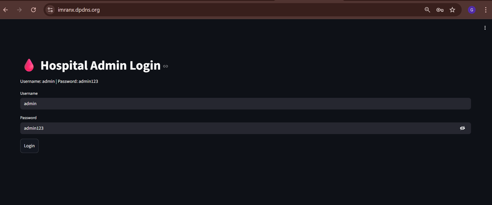
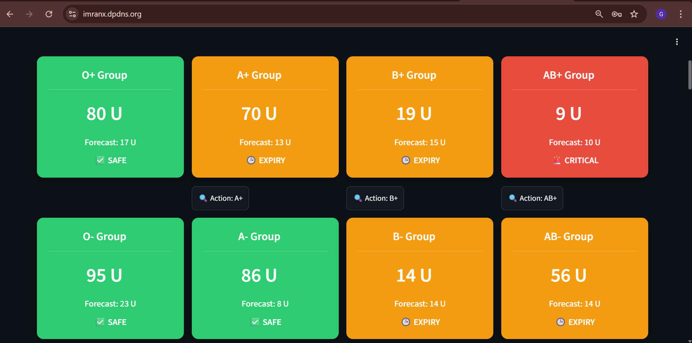
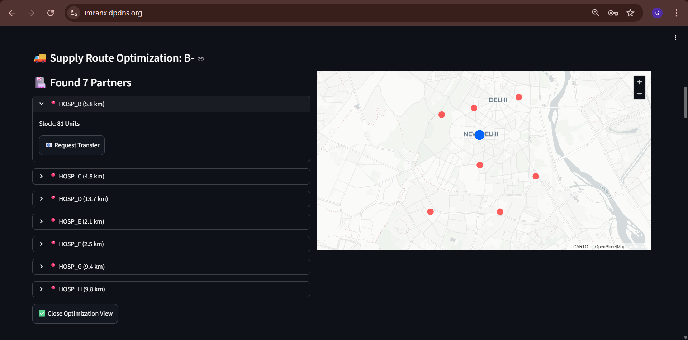
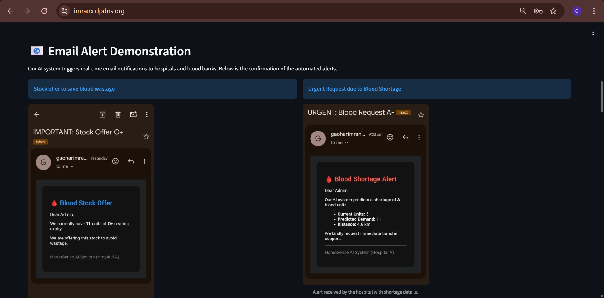
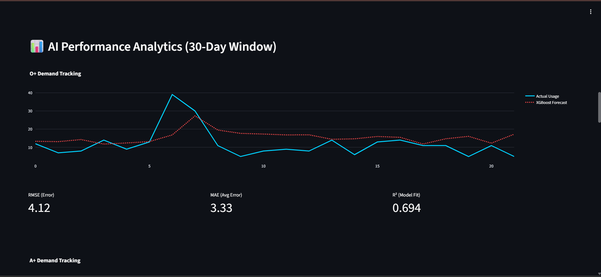

# 🩸 HomoSense AI – Smart Blood Bank Control Center

*HomoSense AI leverages machine learning to optimize blood management in hospitals, reducing wastage and ensuring timely supply.*

---

Access the link at :- https://imranx.dpdns.org

## Project Overview

HomoSense AI is an **intelligent blood management system** designed for hospitals to:

* Monitor current blood stock in real-time.
* Predict blood demand using **XGBoost models** per blood group.
* Identify potential shortages or expiries before they happen.
* Optimize supply routes between hospitals in a city/region (Delhi-NCR).
* Send automated email alerts for urgent blood requests or stock offers.

This system ensures efficient blood utilization, minimizes wastage, and improves hospital preparedness for emergencies.

---

## Features

### 1. Dashboard

* Secure **login system** for hospital admins.
* Use Username **admin** and Password **admin123**



* Overview of all blood groups with:
  * Current stock (Units Available)
  * AI-generated **Forecasted Demand**
  * Status indicators: **SAFE ✅, SHORTAGE ⚠️, EXPIRY 🕒, CRITICAL 🚨**
 


### 2. Real-Time Data Simulation

* Click **➕ Add Data** to simulate real-time hospital logs (Emergency cases, temperature, etc.).
* Click **🔄 Fetch Again** to refresh the pipeline and run the **XGBoost AI models** on new data.
* The AI automatically updates **status boxes and colors** based on the new predictions.

### 3. Supply Route Optimization

* Click **🔍 Action** on a blood group to view nearby partner hospitals on an interactive map.
* Uses **PyDeck** for geospatial visualization.
* Centers map dynamically on the **Hospital A (Main Hub)** and nearby partners.
* Highlights partner locations with available stock to facilitate quick transfers.



### 4. Email Notifications

* Automated HTML-formatted emails for:
  * **Urgent Requests** when a shortage is predicted.
  * **Stock Offers** when units are nearing expiry to prevent wastage.
* Uses **SMTP (smtplib)** with secure app passwords for real-time alerts.



### 5. AI Analytics

* 30-day historical tracking of blood usage per blood group.
* Interactive **Plotly** line plots showing:
  * Actual units used vs. **XGBoost Forecast**
* Real-time display of performance metrics: **RMSE, MAE, R²**



### 6. Hackathon Demo Guide

* Built-in **Demo Guide** for judges to showcase:
  * Real-time data sync
  * AI-driven decision making
  * Logistics and supply chain optimization

---

## How It Works

### 1. Data Pipeline

* Stock and hospital data loaded from CSV files (`current_stock.csv`, `nearest_hospitals.csv`).
* Advanced **Feature Engineering** computed using `build_features()`:
  * Lag values (1, 3, 7 days), Rolling Means, Growth Rate, Expiry Pressure, and Stock Coverage Days
* Contextual features: Traffic Index, Temperature, Weekend, and Holiday flags

### 2. Prediction & Alert System

* For each blood group, pre-trained **XGBoost models** predict the units required for the upcoming period.
* **Alerts triggered** dynamically if current stock is less than predicted demand or if expiration counts are high.

### 3. Supply Optimization

* Identifies partner hospitals with surplus stock for the specific blood group.
* Maps coordinates using **PyDeck ScatterplotLayer**.
* Allows the admin to click **📧 Request Transfer** to instantly email the partner hospital with exact shortage details.

### 4. Analytics & Visualization

* Interactive plots built with **Plotly Graph Objects**
* Metrics calculated from `metrics.json` files to show model reliability
* Helps hospitals track blood demand trends and plan procurement efficiently

---

# ⚙️ Installation & Setup

1. **Clone the repository**
```bash
git clone https://github.com/gaoharimran29-glitch/HomoSense-AI-Smart-Blood-Bank-.git
cd HomoSense-AI-Smart-Blood-Bank-
```
2. Install dependencies
```bash
pip install -r requirements.txt
```
3. Configure Environment Variables
- Create a .env file and add this:
```
EMAIL=your_email@gmail.com
APP_PASSWORD=your_app_password
```
- Ensure you generate an App Password for Gmail to enable SMTP login.
4. Run the Streamlit App
```bash
streamlit run app.py
```

# 📧 Email Integration

1. Supports Gmail SMTP with app password.
2. Sends HTML formatted emails.
3. Two types:
   1. Urgent Blood Request
   2. Stock Offer to avoid wastage

# 💻 Tech Stack

1. Frontend: Streamlit
2. Backend: Python 3.12
3. Machine Learning: XGBoost
4. Data Visualization: Plotly, PyDeck
5. Email: SMTP via Gmail
6. Data Storage: CSV files
7. Environment Management: python-dotenv

# Author

**Gaohar Imran**

Machine Learning & Deep Learning Enthusiast with hands-on experience in **NLP, Computer Vision, and Cloud Deployment**.  
Focused on building **real-world, production-ready AI solutions** rather than only academic models.

##  Connect With Me
- **LinkedIn:** :- https://www.linkedin.com/in/gaohar-imran-5a4063379/

---

> Passionate about turning machine learning models into real, usable applications.
> 
# Support

If you find this project helpful or inspiring, your support is appreciated!

## How You Can Support
- Star this repository
- Fork the project and build upon it
- Share it with others who are learning ML & Deep Learning
- Report issues or suggest improvements

##  Contributions
Contributions are welcome!  
Feel free to open an issue or submit a pull request for improvements, bug fixes, or new features.

---

> Supporting this project helps motivate continuous improvement and future enhancements.
